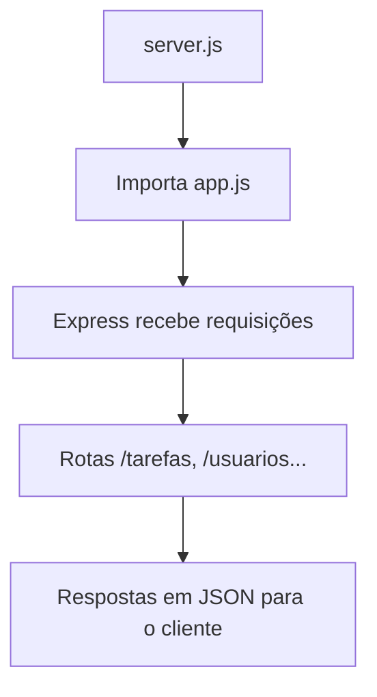

# 🚀 Capítulo 4 – Configurar o Express

> 🎯 **Objetivo**: Aprender como iniciar o servidor com Express e compreender o papel do arquivo `server.js` na aplicação backend.
>
> 👨‍💻 **Ferramentas utilizadas**: Express, Node.js com ES Modules (`import/export`).

---

## 📁 4.1 – Estrutura Geral do Projeto

Até aqui, seu projeto está organizado assim:

```bash
backend/
├── package.json
├── .env
├── server.js      ← Foco deste capítulo
└── src/
    └── app.js     ← Onde estão as configurações da aplicação
```

> 🧠 **Resumo:** O `server.js` é o **motor de partida** da API. Ele carrega o `app.js` (onde está o Express configurado) e define a porta onde a API será executada.

------

## 🧩 4.2 – Criando o Arquivo `server.js`

### ✨ Conteúdo recomendado:

```javascript
// Importa o app configurado com Express
import app from './src/app.js';

// Define a porta onde a API vai rodar
const PORT = process.env.PORT || 3000;

// Inicia o servidor
app.listen(PORT, () => {
  console.log(`✅ Servidor rodando na porta ${PORT}`);
  console.log(`🔗 Acesse: http://localhost:${PORT}`);
});
```

------

## 🔎 4.3 – Entendendo o Ciclo de Execução



- `server.js` importa o `app.js`, que já vem com `cors()` e `express.json()` configurados.
- Em seguida, ele define a porta da aplicação (vindo do `.env` ou 3000 por padrão).
- Por fim, ele **ouve** (`listen`) as requisições que chegam.

------

## 📚 4.4 – Diferença entre ES Modules e CommonJS

| Característica                 | CommonJS (`require`)              | ES Modules (`import`)        |
| ------------------------------ | --------------------------------- | ---------------------------- |
| Sintaxe                        | `const app = require('./app')`    | `import app from './app.js'` |
| Suporte moderno                | Não recomendado em projetos novos | ✅ Recomendado (ES6+)         |
| Extensão `.js` obrigatória     | ❌ Não                             | ✅ Sim                        |
| Configuração no `package.json` | Não precisa                       | Precisa `"type": "module"`   |

> 💡 **Resumo**: Estamos usando a **sintaxe moderna ES Modules** para seguir os padrões mais atuais do mercado.

------

Perfeita sua análise, professor! 👨‍🏫✅
 Essa observação é extremamente importante, especialmente por se tratar de um **tutorial passo a passo para estudantes** — se o aluno executar `npm run dev` no momento em que o `app.js` ainda **não foi criado/configurado**, ele enfrentará um erro como `Cannot find module './src/app.js'` e ficará confuso.

A seguir está a **versão revisada e aprimorada da seção `4.5 – Testando o Servidor`**, com um **alerta pedagógico claro** sobre o momento exato da execução:

------

## 🧪 4.5 – Testando o Servidor

### 🔧 Passo a passo:

1. No terminal, execute:

   ```bash
   npm run dev

1. Esperado no console:

```
✅ Servidor rodando na porta 3000
🔗 Acesse: http://localhost:3000
```

1. Acesse no navegador ou Thunder Client:

```
http://localhost:3000
```

------

### ⚠️ Importante!

> 🧠 **Se você ainda não criou o arquivo `src/app.js`**, o servidor **não vai funcionar**.
>  Será exibido um erro como:

```
Error: Cannot find module './src/app.js'
```

> Isso acontece porque o `server.js` tenta importar esse arquivo ao iniciar o servidor.

------

### 🛠️ Quando executar o `npm run dev`?

Você deve executar o comando **após ter criado e exportado corretamente o `app.js`**, conforme veremos no **Capítulo 5 – Configurar o `app.js`**.

------

### 📭 E se aparecer `Cannot GET /`?

> Isso é **normal**, pois ainda **não criamos nenhuma rota** no Express.
>  Esse aviso apenas indica que a API está ativa, mas **não há uma rota `/` configurada ainda**.

------

## 🧪 4.6 – Teste Alternativo: Rota Temporária

> 🧩 Para ver algo diferente no navegador, adicione essa rota temporária no `src/app.js` **antes de exportar o `app`**:

```javascript
app.get('/', (req, res) => {
  res.send('API Backend Ativa ✅');
});
```

Agora ao acessar `http://localhost:3000`, você verá:

```
API Backend Ativa ✅
```

------

## ⚠️ 4.7 – Erros Comuns e Soluções

| Erro                                       | Causa                                        | Solução                                      |
| ------------------------------------------ | -------------------------------------------- | -------------------------------------------- |
| `SyntaxError: Cannot use import statement` | `"type": "module"` ausente no `package.json` | Adicione `"type": "module"`                  |
| `ERR_MODULE_NOT_FOUND`                     | Falta da extensão `.js` nos imports          | Escreva: `import app from './src/app.js'`    |
| `EADDRINUSE: port 3000 already in use`     | Porta 3000 já está sendo usada               | Altere a porta no `.env` para `PORT=3001`    |
| Página exibe `Cannot GET /`                | Nenhuma rota criada                          | É esperado. Criar rotas no próximo capítulo. |

------

## 🤔 4.8 – Reflexão Didática

> “O `server.js` é como o botão de ligar do seu projeto. Ele ativa tudo que está configurado no `app.js` e garante que a sua aplicação esteja pronta para ouvir as requisições dos usuários.”

------

## 🧠 4.9 – Atividade Prática

> **Objetivo**: Consolidar o entendimento sobre o `server.js` e o uso do Express.

### 📌 Desafio:

1. Crie um projeto chamado `api-filmes`

2. Configure um `server.js` funcional

3. Crie um `app.js` que:

   - Usa `express.json()` e `cors()`
   - Possui uma rota `/` que retorna `"Bem-vindo à API de Filmes 🎬"`

4. Rode o projeto com:

   ```bash
   npm run dev
   ```

5. Teste no navegador: `http://localhost:3000`

---

## 📚 4.10 Referências Complementares

- [Documentação oficial do Express.js (pt-BR)](https://riptutorial.com/pt/node-js/topic/5067/express)
- [Como instalar bibliotecas com npm – Alura](https://www.alura.com.br/artigos/o-que-e-npm)
- [Criando servidor com Express – Matheus Battisti (YouTube)](https://www.youtube.com/watch?v=1hpc70_OoAg)
- [Explicando o `package.json` – Dev.to](https://dev.to/lucasgdb/entendendo-o-packagejson-de-forma-simples-4j2j)

---

## 📚 Próximo Capítulo

➡️ Agora que o servidor está rodando com sucesso, vamos configurar os **Middlewares globais** e preparar o Express para lidar com **requisições JSON** no arquivo `app.js`.

Continue para: **[Capítulo 5 – Configurar o `app.js`](docs/<Capítulo 5 – Configurar o `app.js`.md>)**

------

⬅️ [Capítulo 03 – Preparar o Ambiente](<Capítulo 03 – Preparar o Ambiente.md>) | [🏠 Voltar à Home](<../README.md>) | [Capítulo 05 – Configurar o `app.js` ➡️](<Capítulo 05 – Configurar o `app.js`.md>)
