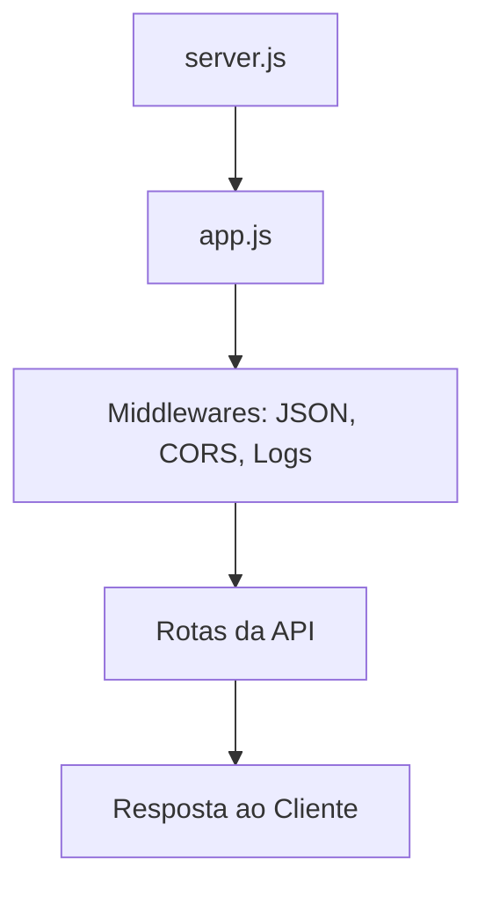

# ⚙️ Capítulo 5 – Configurar o `app.js`

> 🎯 **Objetivo**: Configurar a aplicação Express, aplicar middlewares essenciais, preparar o backend para receber requisições HTTP e estruturar a base para rotas e tratamento de erros.
>
> 👨‍🎓 **Público-alvo**: Alunos do 3º ano do Ensino Médio Técnico em Informática.

---

## 🧠 5.1 – O que é o `app.js`?

O `app.js` é o **coração da aplicação backend**. Ele:

- Cria a instância principal do Express
- Adiciona os **middlewares globais**
- Conecta as **rotas da API**
- Define comportamentos padrão como tratamento de erros
- É exportado e utilizado pelo `server.js`

---

## 🧩 5.2 – Estrutura Visual da Arquitetura



> ✅ O `app.js` recebe a requisição, processa e encaminha para as rotas definidas. Se tudo estiver certo, responde ao cliente.

------

## 🧱 5.3 – Criando o Arquivo `app.js`

Crie o arquivo `src/app.js` com o seguinte conteúdo:

```javascript
// Importa bibliotecas
import express from 'express';
import cors from 'cors';
import morgan from 'morgan';

// Cria a instância do Express
const app = express();

// Middlewares globais
app.use(express.json());       // Permite receber JSON
app.use(cors());               // Libera acesso externo (ex: frontend React)
app.use(morgan('dev'));        // Log das requisições no terminal

// Teste de rota base
app.get('/', (req, res) => {
  res.send('✅ API Backend rodando com sucesso!');
});

// Exporta a instância configurada
export default app;
```

------

## 🧪 5.4 – Testando a Configuração

1. No terminal, execute:

   ```bash
   npm run dev
   ```

2. Acesse:

   ```
   http://localhost:3000/
   ```

3. Resultado esperado:

   ```
   ✅ API Backend rodando com sucesso!
   ```

> 💡 A partir daqui, a API já está preparada para receber rotas como `/usuarios`, `/tarefas` e outras.

------

## 🧠 5.5 – Explicando os Middlewares

| Middleware       | Função                                                       |
| ---------------- | ------------------------------------------------------------ |
| `express.json()` | Transforma o corpo da requisição em JSON automaticamente     |
| `cors()`         | Permite que o frontend acesse a API mesmo estando em outro domínio |
| `morgan('dev')`  | Mostra no terminal logs como: `GET /tarefas 200 5ms`         |

------

## 🔐 5.6 – Configuração Segura de CORS (opcional)

Em produção, você deve **limitar** os domínios que podem acessar sua API:

```javascript
app.use(cors({
  origin: ['http://localhost:5173'],  // Substitua pela URL do seu frontend
  methods: ['GET', 'POST', 'PUT', 'DELETE']
}));
```

------

## 💥 5.7 – Tratamento Global de Erros

Adicione esse bloco **no final do arquivo**, após as rotas:

```javascript
// Middleware de erro global
app.use((err, req, res, next) => {
  console.error(err.stack); // Log do erro
  res.status(500).json({
    erro: 'Erro interno no servidor',
    detalhes: process.env.NODE_ENV === 'development' ? err.message : undefined
  });
});
```

> 🔒 Isso evita que erros travem o servidor e mantém uma resposta padronizada.

------

## 🧪 5.8 – Testes com Thunder Client

1. Instale a extensão **Thunder Client** no VSCode
2. Crie uma requisição:
   - Método: `GET`
   - URL: `http://localhost:3000/`
3. Verifique:
   - Status: `200 OK`
   - Resposta: `"✅ API Backend rodando com sucesso!"`
   - Terminal: log gerado pelo `morgan`

------

## 🤔 5.9 – Reflexão Didática

> “O `app.js` funciona como o **centro de operações** da sua aplicação backend. É nele que decidimos como a API se comporta, como os dados chegam e para onde devem ir.”

------

## 🧠 5.10 – Atividade Prática

> **Objetivo**: Reforçar os conceitos criando um novo `app.js` com todos os middlewares.

### 📌 Desafio:

1. Crie um novo projeto chamado `api-livros`
2. Crie um `app.js` que:
   - Importe `express`, `cors`, `morgan`
   - Adicione os middlewares na ordem correta
   - Crie uma rota `/` que retorne `Bem-vindo à API de Livros 📚`
   - Implemente o tratamento global de erros
3. Teste a rota no navegador ou no Thunder Client

------

## 📚 5.11 – Próximo Capítulo

➡️ Agora que o `app.js` está pronto, vamos começar a trabalhar com dados simulados (mocks) e preparar o fluxo completo entre requisição → resposta.

Continue para: **[Capítulo 6 – Fluxo de Trabalho e Mocks](Capítulo 6 – Fluxo de Trabalho e Mocks.md)**

------

