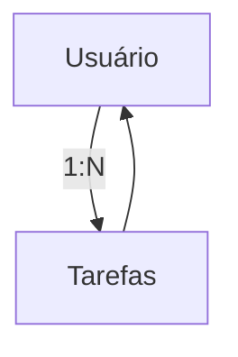

# 🔄 Capítulo 6 – Fluxo de Trabalho na API TO-DO LIST

> 🎯 **Objetivo**: Compreender, de forma conceitual, como funciona o **fluxo de dados** dentro de uma aplicação backend REST no contexto de uma **lista de tarefas (To-Do List)**.
>
> 🧑‍🎓 Público-alvo: Alunos do 3º ano do Ensino Médio Técnico em Informática

---

## 🧩 6.1 – O que é Fluxo de Trabalho em uma API?

No contexto do desenvolvimento backend, o **fluxo de trabalho** representa a **sequência de passos que uma requisição percorre** desde o momento em que é feita por um usuário até o momento em que recebe uma resposta da API.

> Em outras palavras: **o que acontece entre o “clique” do usuário e a resposta do servidor?**

---

## 🧠 6.2 – O Ciclo de uma Requisição

Vamos pensar na seguinte situação:

> "João acessa o aplicativo de tarefas e deseja visualizar sua lista de tarefas do dia."

O que acontece tecnicamente nesse momento?

### 🧭 Etapas do fluxo:

1. **Cliente (João)** envia uma requisição (ex: listar tarefas)
2. Essa requisição chega ao **servidor Express (nosso app.js)**
3. A aplicação identifica qual **ação** deve ser executada (ex: buscar dados)
4. Os dados são **localizados nos mocks** (simulando um banco de dados)
5. O backend **monta uma resposta** em formato JSON
6. O servidor **responde ao cliente** com os dados formatados

---

### 🔁 Representação visual do ciclo

```css
Usuário → Requisição → app.js (middlewares)
        → Lógica de negócio → Mocks (dados simulados)
        → Resposta JSON → Usuário
```

> 🧠 Esse ciclo ocorre em **menos de um segundo**, a cada clique ou ação do usuário.

---

## 📦 6.3 – O Papel dos Mocks no Fluxo

Os **mocks** são arquivos que simulam dados reais. Eles servem como **substitutos temporários** do banco de dados e são fundamentais durante o início do desenvolvimento.

### ✅ Por que usar mocks?

- Permite construir e testar a aplicação **sem precisar de um banco de dados real**
- Facilita a criação de exemplos de dados para testes e demonstrações
- Ajuda a focar na **lógica da API** antes de se preocupar com SQL

---

### 📂 Estrutura esperada dos mocks:

```bash
src/
└── mocks/
    ├── mockUsuarios.js   ← Lista de usuários simulados
    └── mockTarefas.js    ← Lista de tarefas simuladas
```

---

## 🔗 6.4 – Relacionamento entre Usuários e Tarefas

Na nossa aplicação TO-DO LIST:

- Cada **usuário** pode ter **múltiplas tarefas**
- Cada **tarefa** está ligada a **um único usuário**

### 🔁 Tipo de relacionamento: **1 para N**

| Entidade | Ligação                        |
| -------- | ------------------------------ |
| Usuário  | 1 (um usuário)                 |
| Tarefa   | N (várias tarefas por usuário) |

---

### 📈 Diagrama Visual



---

## 🛠️ 6.5 – O que acontece com os dados?

Os arquivos de mock contêm dados semi-estruturados como objetos. Esses dados são **acessados, filtrados, modificados e retornados** conforme as ações solicitadas pelo usuário da aplicação (como listar, criar ou concluir tarefas).

> 📌 Exemplo de ação: **"Mostrar todas as tarefas de João"**  
> O sistema precisa:
>
> 1. Identificar quem é João
> 2. Encontrar todas as tarefas que pertencem ao ID dele
> 3. Retornar uma resposta com esses dados

---

## 🧱 6.6 – Preparando para o Banco de Dados

Os mocks são temporários. Eles ajudam no desenvolvimento e nos testes iniciais, mas em breve:

- Serão **substituídos por um banco de dados real (MySQL)**
- O fluxo continuará o mesmo, mas os dados virão **do banco de verdade**
- As rotas e lógicas que estamos praticando com mocks **serão mantidas**

---

## 🤔 6.7 – Reflexão Didática

> “Antes de aprender a consultar um banco real, é importante entender como os dados **fluem** dentro da aplicação. Se você domina o caminho da requisição até a resposta, o banco de dados será apenas mais uma fonte de informação.”

---

## 🧠 6.8 – Atividade Prática

> 🎯 **Objetivo**: Refletir sobre o fluxo de dados e criar uma representação visual.

### 📝 Tarefa:

1. Em dupla, desenhem no caderno ou em uma folha:
   - O caminho que os dados percorrem desde o clique do usuário até a resposta da API
2. Indiquem onde os mocks entram nesse caminho
3. Marquem os passos do servidor (ex: Express, lógica, dados, resposta)

> 💬 Na próxima aula, vamos compartilhar os desenhos e comentar juntos o que foi entendido sobre o fluxo da API.

---

## 📚 6.9 – Próximo Capítulo

➡️ Agora que compreendemos como os dados percorrem o backend, vamos implementar as **rotas REST completas** com base nesses dados simulados.

Continue para: **[Capítulo 7 – Conceitos Fundamentais de HTTP](./Capítulo 7 – Conceitos Fundamentais de HTTP.md)**

---

