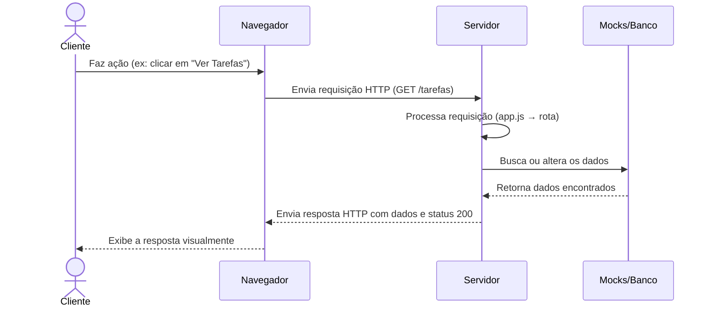

# 🌐 Capítulo 7 – Conceitos Fundamentais de HTTP e o CRUD em APIs REST

> 🎯 **Objetivo**: Compreender o papel do protocolo HTTP no funcionamento das APIs REST, identificar os métodos HTTP que compõem o CRUD e entender o ciclo completo de uma requisição no backend.
>
> 👨‍🎓 Público-alvo: Alunos do 3º ano do Ensino Médio Técnico em Informática

---

## 🧠 7.1 – O que é HTTP?

O **HTTP (Hypertext Transfer Protocol)** é o protocolo que permite a **comunicação entre cliente e servidor**. Ele é o "idioma" da internet: toda vez que acessamos uma página, fazemos login, enviamos mensagens ou interagimos com aplicativos online, estamos utilizando **requisições HTTP**.

### 💬 Analogia didática:

> Imagine que você está em um restaurante. O **cliente** é o navegador ou aplicativo; o **garçom** é o HTTP; e a **cozinha** é o servidor.  
> O cliente faz um pedido → o garçom anota e leva à cozinha → a cozinha prepara → o garçom traz o prato de volta → o cliente recebe a refeição.  
>
> ✅ Esse ciclo é exatamente como uma requisição HTTP funciona!

---

## 📬 7.2 – Estrutura de uma Requisição HTTP

Uma requisição HTTP é composta por:

| Parte            | O que representa                                             |
| ---------------- | ------------------------------------------------------------ |
| **Método HTTP**  | A ação que o cliente quer executar (ex: buscar, criar, deletar) |
| **URL/Endpoint** | O endereço do recurso no servidor (ex: `/tarefas`, `/usuarios/1`) |
| **Headers**      | Informações adicionais (ex: tipo de conteúdo, autorização, etc.) |
| **Body (corpo)** | Dados enviados pelo cliente (usado em POST e PUT)            |

---

## 🧰 7.3 – Métodos HTTP e o CRUD

Os métodos HTTP definem o **tipo de ação** que o cliente deseja executar. Em APIs REST, esses métodos se alinham perfeitamente com o conceito de **CRUD**, que representa as operações básicas sobre dados.

### 📘 CRUD = Create, Read, Update, Delete

| Método HTTP | Ação no CRUD | Significado                | Uso comum                                |
| ----------- | ------------ | -------------------------- | ---------------------------------------- |
| `POST`      | **Create**   | Criar novo recurso         | Cadastrar nova tarefa ou usuário         |
| `GET`       | **Read**     | Ler ou buscar dados        | Listar tarefas, buscar usuário           |
| `PUT`       | **Update**   | Atualizar dados existentes | Editar tarefa, alterar nome ou status    |
| `PATCH`     | **Update**   | Atualizar parcialmente     | Alterar só um campo específico           |
| `DELETE`    | **Delete**   | Remover um recurso         | Excluir tarefa, deletar conta de usuário |

---

## 🔍 7.4 – Códigos de Status HTTP

A resposta de uma requisição HTTP **sempre vem com um código de status**. Esse número informa ao cliente se a requisição foi bem-sucedida ou se ocorreu algum erro.

### 🧾 Tabela ampliada de códigos HTTP

| Código | Categoria          | Significado           | Quando acontece                                              |
| ------ | ------------------ | --------------------- | ------------------------------------------------------------ |
| `200`  | ✅ Sucesso          | OK                    | Ação executada com sucesso                                   |
| `201`  | ✅ Sucesso          | Created               | Novo recurso criado com sucesso                              |
| `204`  | ✅ Sucesso          | No Content            | Requisição bem-sucedida, mas sem corpo na resposta (ex: DELETE) |
| `400`  | ⚠️ Erro do cliente  | Bad Request           | Erro na requisição (ex: dados obrigatórios ausentes)         |
| `401`  | ⚠️ Erro do cliente  | Unauthorized          | Requisição sem autenticação válida                           |
| `403`  | ⚠️ Erro do cliente  | Forbidden             | Acesso negado, mesmo autenticado                             |
| `404`  | ⚠️ Erro do cliente  | Not Found             | Recurso não encontrado (ex: ID inexistente)                  |
| `409`  | ⚠️ Erro do cliente  | Conflict              | Dados em conflito (ex: e-mail já cadastrado)                 |
| `422`  | ⚠️ Erro do cliente  | Unprocessable Entity  | Dados válidos no formato, mas sem lógica (ex: tarefa sem título) |
| `500`  | ❌ Erro do servidor | Internal Server Error | Erro inesperado no backend                                   |
| `503`  | ❌ Erro do servidor | Service Unavailable   | Servidor indisponível ou em manutenção                       |

> 💡 **Dica**: Aprender os códigos HTTP é essencial para o desenvolvimento profissional de APIs!

---

## 📈 7.5 – Ciclo Completo de uma Requisição HTTP

Vamos visualizar o fluxo completo de uma requisição HTTP dentro da nossa futura API TO-DO LIST:

------

## 🧩 7.6 – CRUD aplicado à API TO-DO LIST

| Ação desejada pelo usuário | Método HTTP | Caminho esperado | Código de sucesso |
| -------------------------- | ----------- | ---------------- | ----------------- |
| Criar nova tarefa          | POST        | `/tarefas`       | `201 Created`     |
| Listar todas as tarefas    | GET         | `/tarefas`       | `200 OK`          |
| Buscar tarefa específica   | GET         | `/tarefas/2`     | `200 OK` ou `404` |
| Atualizar uma tarefa       | PUT         | `/tarefas/2`     | `200 OK` ou `404` |
| Remover tarefa             | DELETE      | `/tarefas/2`     | `204 No Content`  |

------

## 🧠 7.7 – Situações Reais: Identificando Métodos HTTP

Vamos associar ações cotidianas com os métodos corretos:

| Situação                          | Método HTTP |
| --------------------------------- | ----------- |
| Fazer login em uma conta          | POST        |
| Ver seu histórico de compras      | GET         |
| Atualizar seu endereço de entrega | PUT / PATCH |
| Apagar uma conta em um sistema    | DELETE      |
| Buscar um produto no site da loja | GET         |
| Cadastrar uma nova senha          | POST        |

------

## 🎯 7.8 – Atividade Prática: Entendendo Requisições HTTP

> 💬 **Objetivo**: Refletir sobre como o protocolo HTTP está presente em ações do nosso dia a dia digital.

### 📌 Instruções:

1. Em dupla, preencham a tabela abaixo com **ações reais que usam a internet** (sites, apps, sistemas).
2. Para cada ação, identifiquem o método HTTP que acreditam ser usado.

| Ação do dia a dia        | Método HTTP | Tipo de resposta esperada (status) |
| ------------------------ | ----------- | ---------------------------------- |
| Ex: Criar conta no Gmail | POST        | 201 Created                        |
|                          |             |                                    |
|                          |             |                                    |
|                          |             |                                    |

1. Compartilhem suas respostas com a turma. Vamos discutir os diferentes tipos de resposta e qual método seria mais adequado.

------

## 📚 7.9 – Próximo Capítulo

➡️ Agora que você conhece os **métodos HTTP**, o **significado dos códigos de status** e o **ciclo de uma requisição**, você está pronto para escrever seus **primeiros endpoints REST na prática!**

Continue para: **[Capítulo 8 – Endpoints e Rotas](Capítulo 8 – Endpoints e Rotas.md)**

------

