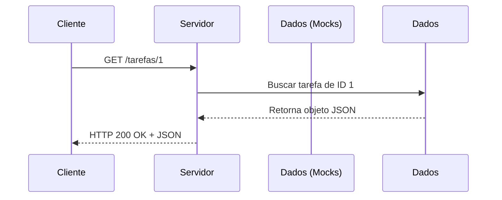

# 📖 Capítulo 9.1 – Entendendo o Método HTTP GET

> 🎯 **Objetivo**: Compreender em profundidade o funcionamento do método HTTP `GET`, sua finalidade dentro do CRUD, boas práticas REST, formatos de resposta e situações reais de uso.
>
> 👨‍🎓 Público-alvo: Alunos do 3º ano do Ensino Médio Técnico em Informática

---

## 🌐 9.1.1 – O que é o Método `GET`?

O método HTTP `GET` é utilizado para **buscar informações** em um servidor.  
É o verbo usado quando queremos **ler dados**, **consultar registros**, ou simplesmente **visualizar algo** armazenado.

> 🧠 Em uma API, o `GET` é o equivalente ao **"Ler"** do CRUD (**Read**).

---

### 📦 Exemplos do dia a dia com `GET`:

| Ação real                                      | Endpoint simulado  |
| ---------------------------------------------- | ------------------ |
| Ver minha lista de tarefas                     | `GET /tarefas`     |
| Ver os dados de um usuário específico          | `GET /usuarios/2`  |
| Acessar um perfil público de rede social       | `GET /perfil/joao` |
| Ver os detalhes de um produto numa loja online | `GET /produtos/55` |

---

## 🔀 9.1.2 – Tipos de Consulta com GET

| Tipo de requisição  | Significado                                | Exemplo          |
| ------------------- | ------------------------------------------ | ---------------- |
| `GET /entidade`     | Lista todos os registros de uma entidade   | `GET /tarefas`   |
| `GET /entidade/:id` | Busca apenas um registro específico por ID | `GET /tarefas/3` |

---

## 🧪 9.1.3 – O que esperar de uma resposta `GET`

Toda requisição `GET` deve retornar:

1. Um **status HTTP**
2. Um **corpo de resposta** (geralmente em JSON)
3. Os **dados solicitados**, ou uma **mensagem de erro**

### ✅ Exemplo de sucesso:

```json
{
  "success": true,
  "data": {
    "id": 1,
    "titulo": "Estudar JavaScript",
    "concluida": false
  }
}
```

### ❌ Exemplo de erro (recurso não encontrado):

```json
{
  "success": false,
  "error": "Tarefa não encontrada!"
}
```

------

## 📊 9.1.4 – Códigos de status comuns para GET

| Código | Significado           | Quando utilizar?                                     |
| ------ | --------------------- | ---------------------------------------------------- |
| `200`  | OK                    | Requisição bem-sucedida. Os dados foram encontrados. |
| `404`  | Not Found             | O recurso solicitado não existe.                     |
| `400`  | Bad Request           | O parâmetro da URL está malformado ou inválido.      |
| `500`  | Internal Server Error | Erro inesperado no servidor                          |

------

## 📚 9.1.5 – Boas práticas no uso do `GET` em APIs REST

| Prática recomendada                   | Justificativa pedagógica                                    |
| ------------------------------------- | ----------------------------------------------------------- |
| Não utilizar `GET` para alterar dados | O método `GET` é apenas leitura. Ele **nunca** altera dados |
| Retornar JSON estruturado             | Facilita a leitura e uso no frontend                        |
| Validar a existência do ID buscado    | Evita erros e comportamentos inesperados                    |
| Usar status `404` para dados ausentes | Segue padrão de comunicação entre sistemas RESTful          |

------

## 🔄 9.1.6 – Diagrama do fluxo de uma requisição GET



> 💡 Se o ID 1 não existir, o servidor responde com `404 Not Found`.

------

## 🧠 9.1.7 – Reflexão Didática

> “Saber ler os dados corretamente é tão importante quanto saber salvá-los. O método `GET` representa o primeiro contato do cliente com as informações da API — por isso, ele deve ser limpo, previsível e seguro.”

------

## 📝 9.1.8 – Atividade de Fixação

### 📌 Situação-problema:

Você está desenvolvendo uma API para uma biblioteca online. Sua tarefa é organizar os possíveis endpoints do tipo `GET`.

1. Complete a tabela abaixo:

| O que o usuário deseja fazer               | Qual seria o endpoint? |
| ------------------------------------------ | ---------------------- |
| Ver todos os livros disponíveis            |                        |
| Ver detalhes de um livro específico (ID 7) |                        |
| Ver todos os empréstimos realizados        |                        |
| Buscar um usuário pelo ID                  |                        |

1. Para cada linha, diga qual seria o status HTTP esperado caso a informação exista, e qual seria se ela **não existir**.

------

## 📚 9.1.9 Referências Complementares

- [Verbo GET no HTTP – Alura](https://www.alura.com.br/artigos/o-que-e-o-protocolo-http)
- [Métodos HTTP – Mozilla Developer Network](https://developer.mozilla.org/pt-BR/docs/Web/HTTP/Methods)
- [Explicando métodos HTTP – Curso em Vídeo](https://www.youtube.com/watch?v=iAKnBME5Fqo&t=489s)
- [GET com Express – W3Schools](https://www.w3schools.com/nodejs/nodejs_http.asp)

---

## 🚀 9.1.10 – Preparando para o Código

Agora que você **entende claramente o funcionamento do método GET**, no próximo capítulo vamos **colocar isso em prática**: criaremos rotas para retornar **todos os usuários, uma tarefa específica e mais**, usando mocks como fonte de dados.

➡️ Continue para: **[Capítulo 9.2 – Criando Endpoints GET com Mocks](Capítulo 9.2 – Criando Endpoints GET com Mocks.md)**

------

⬅️ [Capítulo 09.0 – Explorando o Express e a Instância `app`](<Capítulo 09.0 – Explorando o Express e a Instância `app`.md>) | [🏠 Voltar à Home](<../README.md>) | [Capítulo 09.2 – GET Lógica e Organização do Pensamento ➡️](<Capítulo 09.2 –  GET Lógica e Organização do Pensamento.md>)
