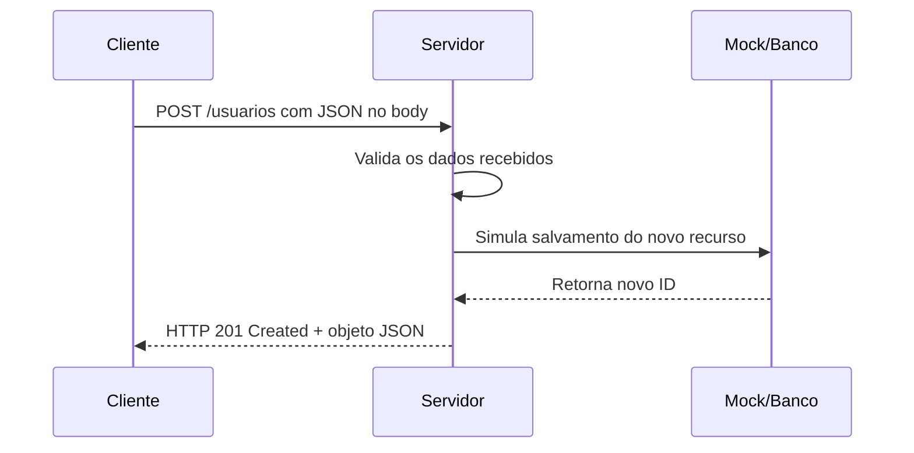

# ✉️ Capítulo 10.1 – Entendendo o Método HTTP POST

> 🎯 **Objetivo**: Compreender como funciona o método HTTP `POST` dentro de uma API REST, sua finalidade na criação de novos dados e as boas práticas para validação, estrutura e respostas.
>
> 👨‍🎓 Público-alvo: Alunos do 3º ano do Ensino Médio Técnico em Informática

---

## 🧠 10.1.1 – O que é o Método `POST`?

O método `POST` é usado em APIs REST para **enviar dados ao servidor e criar um novo recurso**.  
Ele representa a ação de **Criar** no CRUD (**Create**).

> 📌 Ao contrário do `GET`, que apenas lê dados, o `POST` envia informações **no corpo da requisição** (body) para serem processadas e armazenadas.

---

### 💡 Exemplo do mundo real:

Imagine um formulário de cadastro. Ao clicar em "Cadastrar", os dados do formulário (nome, e-mail, senha...) são enviados para o servidor via `POST`.

---

## ✉️ 10.1.2 – Estrutura da Requisição `POST`

| Elemento         | Descrição                                                    |
| ---------------- | ------------------------------------------------------------ |
| **Método**       | `POST`                                                       |
| **URL**          | Endpoint da entidade (ex: `/usuarios`)                       |
| **Headers**      | Deve conter `Content-Type: application/json`                 |
| **Body (corpo)** | Contém os dados do novo recurso a ser criado, geralmente em formato JSON |

---

### 📦 Exemplo de Requisição `POST /usuarios`

```json
{
  "nome": "Carlos Andrade",
  "email": "carlos@exemplo.com"
}
```

------

## 📊 10.1.3 – Códigos de status comuns no `POST`

| Código | Significado           | Quando utilizar                                              |
| ------ | --------------------- | ------------------------------------------------------------ |
| `201`  | Created               | Recurso criado com sucesso                                   |
| `400`  | Bad Request           | Dados inválidos ou ausentes                                  |
| `409`  | Conflict              | Tentativa de criar um recurso que já existe (ex: e-mail duplicado) |
| `500`  | Internal Server Error | Erro inesperado no servidor                                  |

------

## 📦 10.1.4 – O que a resposta de um `POST` deve conter?

- Status 201 (`Created`)
- Objeto recém-criado (com ID gerado automaticamente)
- Mensagem de sucesso (opcional)

### ✅ Exemplo de resposta bem-sucedida:

```json
{
  "success": true,
  "data": {
    "id": 3,
    "nome": "Carlos Andrade",
    "email": "carlos@exemplo.com"
  }
}
```

------

## 🔐 10.1.5 – Validações importantes no `POST`

Antes de aceitar e armazenar os dados recebidos no `POST`, o servidor deve realizar algumas **validações fundamentais**:

| Validação                              | Por que é importante?                     |
| -------------------------------------- | ----------------------------------------- |
| Verificar campos obrigatórios          | Evita criação de dados incompletos        |
| Verificar duplicidade (ex: e-mail)     | Evita inconsistência ou conflitos futuros |
| Validar formato dos dados (ex: e-mail) | Garante qualidade e integridade dos dados |

------

## 📘 10.1.6 – Boas práticas no uso do POST em APIs REST

| Boa prática                             | Motivo                                              |
| --------------------------------------- | --------------------------------------------------- |
| Gerar o ID automaticamente (simulado)   | Em bancos reais, o ID é gerado com `AUTO_INCREMENT` |
| Retornar todos os dados do novo recurso | Facilita testes e uso no frontend                   |
| Validar entrada antes de salvar         | Evita erros e bugs durante o uso da API             |
| Utilizar `status 201 Created`           | Indica que o recurso foi criado com sucesso         |

------

## 🧰 10.1.7 – Comparação entre `POST` e `GET`

| Característica            | `GET`          | `POST`                         |
| ------------------------- | -------------- | ------------------------------ |
| Tipo de operação          | Leitura        | Criação                        |
| Corpo da requisição       | Não possui     | Possui (`body` com dados JSON) |
| Alterações no servidor    | Nenhuma        | Sim (gera novo recurso)        |
| Status esperado (sucesso) | `200 OK`       | `201 Created`                  |
| Parâmetros na URL         | Sim (opcional) | Geralmente não                 |

------

## 📚 10.1.8 – Situações reais que usam `POST`

| Ação na web / app                             | Método esperado |
| --------------------------------------------- | --------------- |
| Cadastrar um novo usuário                     | POST            |
| Criar uma nova tarefa no app de produtividade | POST            |
| Enviar uma mensagem em um chat                | POST            |
| Solicitar uma nova senha por e-mail           | POST            |

------

## 📈 10.1.9 – Diagrama do fluxo de uma requisição POST



------

## 🧠 10.1.10 – Reflexão Didática

> “Criar dados com segurança e clareza é o primeiro passo para uma API confiável. O `POST` representa a **entrada controlada de informações**. Validar, organizar e responder corretamente transforma um simples formulário em um sistema profissional.”

------

## 📝 10.1.11 – Atividade de Fixação

### 📌 Tarefa:

Analise as situações abaixo e preencha a tabela:

| Ação                                  | Dados obrigatórios     | O que validar?                  | Status esperado |
| ------------------------------------- | ---------------------- | ------------------------------- | --------------- |
| Criar um novo usuário                 | nome, email            | Campos vazios, e-mail duplicado | `201` ou `400`  |
| Criar nova tarefa para um usuário     | título, usuario_id     | Ver se o usuário existe         | `201` ou `404`  |
| Criar produto com campo "preço" vazio | nome, descrição, preço | Validar se preço é numérico     | `400`           |

---

## 📚 10.1.12 Referências Complementares

- [Verbo POST explicado – Alura](https://www.alura.com.br/artigos/o-que-e-o-protocolo-http)
- [Método POST em APIs REST – DevMedia](https://www.devmedia.com.br/rest-com-metodo-post/29863)
- [Enviando dados com POST – Curso em Vídeo](https://www.youtube.com/watch?v=iAKnBME5Fqo&t=489s)
- [Requisições POST com Node/Express – YouTube (Tiago Matos)](https://www.youtube.com/watch?v=bklc2dc7s0c)

---

## 📚 Próximo Capítulo

Agora que você entendeu como funciona o método `POST`, vamos aprender a **criar os endpoints reais de criação de usuários e tarefas**, utilizando os dados mockados e validando as entradas.

➡️ Continue para: **[Capítulo 10.2 – Criando Endpoints POST com Mocks](docs/<Capítulo 10.2 – POST Lógica e Organização do Pensamento.md>)**

------

⬅️ [Capítulo 09.3 – Criando Endpoints GET com Mocks](<Capítulo 09.3 – Criando Endpoints GET.md>) | [🏠 Voltar à Home](<README.md>) | [Capítulo 10.2 – POST Lógica e Organização do Pensamento ➡️](<Capítulo 10.2 – POST Lógica e Organização do Pensamento.md>)
