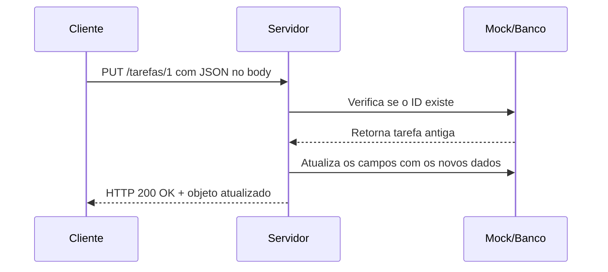

# 🛠️ Capítulo 11.1 – Entendendo o Método HTTP PUT

> 🎯 **Objetivo**: Compreender o funcionamento do método HTTP `PUT` dentro das APIs REST, como ele é utilizado para atualizar registros existentes e quais cuidados devem ser tomados.
>
> 👨‍🎓 Público-alvo: Alunos do 3º ano do Ensino Médio Técnico em Informática

---

## 🔄 11.1.1 – O que é o Método `PUT`?

O método `PUT` serve para **atualizar completamente** um registro existente no servidor. Ele faz parte do CRUD e representa a ação de **Update**.

> 🧠 Em REST, o `PUT` envia uma nova versão **completa** do recurso que deve substituir a anterior.

---

## 🧰 11.1.2 – Diferença entre `PUT` e `PATCH`

| Método  | Atualização  | Quando usar?                             |
| ------- | ------------ | ---------------------------------------- |
| `PUT`   | **Completa** | Envia todos os campos novamente          |
| `PATCH` | **Parcial**  | Altera apenas os campos enviados no body |

> 🔎 Em APIs simples (como a nossa), `PUT` é suficiente para atualizar os campos desejados, mesmo que o restante do objeto não seja enviado.

---

## 📦 11.1.3 – Estrutura da Requisição `PUT`

| Elemento    | Descrição                                       |
| ----------- | ----------------------------------------------- |
| **Método**  | `PUT`                                           |
| **URL**     | Deve conter o ID do recurso (ex: `/usuarios/2`) |
| **Headers** | `Content-Type: application/json`                |
| **Body**    | JSON com os campos que devem ser atualizados    |

---

### ✅ Exemplo:

```http
PUT /usuarios/2
Content-Type: application/json
{
  "nome": "Maria Souza Atualizada"
}
```

------

## 📊 11.1.4 – Códigos de Status Comuns no `PUT`

| Código | Significado           | Quando usar?                            |
| ------ | --------------------- | --------------------------------------- |
| `200`  | OK                    | Recurso atualizado com sucesso          |
| `400`  | Bad Request           | Dados ausentes ou malformados           |
| `404`  | Not Found             | O recurso com o ID fornecido não existe |
| `500`  | Internal Server Error | Erro inesperado no servidor             |

------

## 🧠 11.1.5 – O que o servidor deve fazer em um `PUT`?

1. **Ler o ID** da URL
2. Verificar se o recurso existe
3. Atualizar os dados no array ou banco
4. Retornar o recurso atualizado com `status 200`

------

## 📚 11.1.6 – Situações reais que usam `PUT`

| Situação no sistema                      | Método usado |
| ---------------------------------------- | ------------ |
| Atualizar o nome de um usuário           | `PUT`        |
| Corrigir o título de uma tarefa          | `PUT`        |
| Marcar uma tarefa como concluída         | `PUT`        |
| Trocar o e-mail de contato de um cliente | `PUT`        |

------

## 🧪 11.1.7 – Exemplo de resposta do servidor

### 🟢 Sucesso (`200 OK`):

```json
{
  "success": true,
  "data": {
    "id": 2,
    "nome": "Maria Souza Atualizada",
    "email": "maria@email.com"
  }
}
```

------

### 🔴 Erro – Usuário não encontrado (`404 Not Found`):

```json
{
  "success": false,
  "error": "Usuário não encontrado!"
}
```

------

## 📘 11.1.8 – Boas práticas no uso do `PUT`

| Boas práticas                  | Justificativa                              |
| ------------------------------ | ------------------------------------------ |
| Validar se o ID existe         | Evita tentar atualizar algo que não existe |
| Preservar o ID original        | O ID não deve ser alterado na atualização  |
| Retornar o objeto atualizado   | Ajuda o frontend a refletir a nova versão  |
| Trabalhar com JSON estruturado | Facilita integração e testes               |

------

## 📈 11.1.9 – Diagrama do Fluxo de uma Requisição PUT



------

## 🧠 11.1.10 – Reflexão Didática

> “Atualizar é corrigir, melhorar ou adaptar um dado. O método `PUT` nos ensina que toda informação pode evoluir — desde que com atenção, responsabilidade e validação.”

------

## 📝 11.1.11 – Atividade de Fixação

### 📌 Tarefa:

Complete a tabela a seguir com base em diferentes situações de atualização.

| Ação desejada pelo usuário                 | Endpoint esperado | Campo(s) a atualizar | Status esperado |
| ------------------------------------------ | ----------------- | -------------------- | --------------- |
| Corrigir o título de uma tarefa            |                   |                      |                 |
| Marcar uma tarefa como concluída           |                   |                      |                 |
| Corrigir o nome de um usuário              |                   |                      |                 |
| Atualizar o usuário vinculado a uma tarefa |                   |                      |                 |

---

## 📚 11.1.12 Referências Complementares

- [Pensando a lógica antes de atualizar registros – Alura](https://cursos.alura.com.br/forum/topico-put-patch-e-delete-125001)
- [Atualizações seguras em APIs RESTful – Medium](https://medium.com/@oieduardorabelo/boas-pr%C3%A1ticas-em-apis-rest-5e0bdc56c7f8)
- [Como planejar uma atualização completa de recurso – Dev.to](https://dev.to/ruanmartinelli/planeje-suas-rotas-rest-com-express-1fa2)
- [Usando `findIndex` para localizar objetos – MDN](https://developer.mozilla.org/pt-BR/docs/Web/JavaScript/Reference/Global_Objects/Array/findIndex)

---

## 📚 Próximo Capítulo

Agora que você entendeu o funcionamento do método `PUT`, vamos praticar a sua aplicação com dados mockados.

➡️ Continue para: **[Capítulo 11.2 – Criando Endpoints PUT com Mocks](docs/<Capítulo 11.2 – PUT Lógica e Organização do Pensamento.md>)**

------

⬅️ [Capítulo 11.1 – Entendendo o Método HTTP PUT](<Capítulo 11.1 – Entendendo o Método HTTP PUT.md>) | [🏠 Voltar à Home](<../README.md>) | [Capítulo 11.3 – Criando Endpoints PUT com Mocks ➡️](<Capítulo 11.2 – PUT Lógica e Organização do Pensamento.md>)
