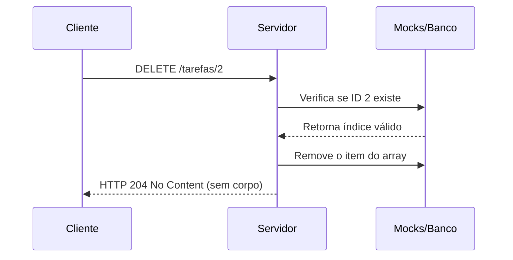

# ❌ Capítulo 12.1 – Entendendo o Método HTTP DELETE

> 🎯 **Objetivo**: Compreender o funcionamento do método HTTP `DELETE`, como ele é utilizado para remover dados de um sistema e as boas práticas associadas ao seu uso em APIs REST.
>
> 👨‍🎓 Público-alvo: Alunos do 3º ano do Ensino Médio Técnico em Informática

---

## 💣 12.1.1 – O que é o Método `DELETE`?

O método HTTP `DELETE` é utilizado para **remover um recurso** do servidor.  
Ele representa a ação de **Delete** no CRUD (Create, Read, Update, **Delete**).

> 🧠 O `DELETE` é irreversível em sistemas sem controle de versões. Por isso, **deve ser usado com cuidado**.

---

## ✂️ 12.1.2 – Estrutura da Requisição `DELETE`

| Elemento            | Descrição                                                    |
| ------------------- | ------------------------------------------------------------ |
| **Método**          | `DELETE`                                                     |
| **URL**             | Deve conter o ID do recurso (ex: `/usuarios/3`)              |
| **Headers**         | Não requer `Content-Type`, pois **não há corpo** na maioria dos casos |
| **Body (opcional)** | Em APIs REST simples, o `DELETE` **não precisa de body**     |

---

## 📊 12.1.3 – Códigos de Status Comuns no `DELETE`

| Código | Significado           | Quando usar?                                        |
| ------ | --------------------- | --------------------------------------------------- |
| `204`  | No Content            | Recurso removido com sucesso, sem corpo na resposta |
| `404`  | Not Found             | O recurso a ser removido não foi encontrado         |
| `500`  | Internal Server Error | Falha inesperada na remoção                         |

> 💡 Retornar um `204` sem conteúdo é uma **boa prática REST**.

---

## 📦 12.1.4 – Exemplo prático

### Requisição:

```http
DELETE /usuarios/3
```

### Resposta esperada:

- Status: `204 No Content`
- Corpo: *nenhum* (resposta vazia)

------

## 📋 12.1.5 – Diferença entre DELETE e outros métodos

| Método   | Função    | Espera dados no body? | Tem corpo na resposta? |
| -------- | --------- | --------------------- | ---------------------- |
| `GET`    | Buscar    | ❌                     | ✅ Sim                  |
| `POST`   | Criar     | ✅                     | ✅ Sim                  |
| `PUT`    | Atualizar | ✅                     | ✅ Sim                  |
| `DELETE` | Remover   | ❌ (em geral)          | ❌ (204 = sem conteúdo) |

------

## 🔐 12.1.6 – Cuidados e Boas Práticas com `DELETE`

| Boa prática                          | Justificativa                                 |
| ------------------------------------ | --------------------------------------------- |
| Confirmar se o ID existe antes       | Evita tentar apagar algo que não existe       |
| Retornar status `204` se for sucesso | Segue padrão REST e reduz tráfego de resposta |
| Retornar `404` se o ID não existir   | Fornece feedback útil ao cliente              |
| Nunca incluir corpo na resposta 204  | Vai contra a especificação HTTP               |

------

## 🧠 12.1.7 – Situações reais que usam `DELETE`

| Ação no sistema                                | Método usado |
| ---------------------------------------------- | ------------ |
| Apagar uma tarefa finalizada                   | `DELETE`     |
| Deletar um usuário do sistema                  | `DELETE`     |
| Cancelar uma compra antes da confirmação       | `DELETE`     |
| Remover uma mensagem de um chat (ex: WhatsApp) | `DELETE`     |

------

## 📈 12.1.8 – Diagrama do fluxo de uma requisição DELETE



------

## 🔍 12.1.9 – Reações esperadas ao testar

| Cenário                                  | Status HTTP | Corpo da resposta                  |
| ---------------------------------------- | ----------- | ---------------------------------- |
| ID existente removido                    | 204         | (nenhum)                           |
| ID inexistente                           | 404         | `{"error": "Não encontrado"}`      |
| ID inválido (ex: texto em vez de número) | 404 ou 400  | Erro de validação, se implementado |

------

## 🧠 12.1.10 – Reflexão Didática

> “Saber excluir é também uma responsabilidade. Uma API madura respeita o ciclo de vida da informação e garante que sua remoção seja feita com segurança, previsibilidade e clareza.”

------

## 📝 12.1.11 – Atividade de Fixação

### 📌 Tarefa:

1. Analise as ações abaixo e defina:
   - Qual seria a **rota correta**
   - O **status esperado**
   - E se deve ou não haver **resposta no corpo**

| Ação realizada                        | Endpoint | Status esperado | Corpo na resposta? |
| ------------------------------------- | -------- | --------------- | ------------------ |
| Apagar um usuário                     |          |                 |                    |
| Remover uma tarefa com ID inexistente |          |                 |                    |
| Cancelar uma compra antes de ser paga |          |                 |                    |
| Tentar remover algo já excluído       |          |                 |                    |

---

## 📚 12.1.12 Referências Complementares

- [Verbo DELETE explicado – Alura](https://www.alura.com.br/artigos/o-que-e-o-protocolo-http)
- [Remoção de dados com DELETE – DevMedia](https://www.devmedia.com.br/api-rest-com-delete/29865)
- [Método DELETE na prática – Curso em Vídeo](https://www.youtube.com/watch?v=iAKnBME5Fqo&t=1001s)
- [Boas práticas ao excluir dados em APIs REST – Medium](https://medium.com/@ruanmartinelli/remocao-segura-de-recursos-em-apis-rest-1b7e8e0d69b3)

---

## 📚 Próximo Capítulo

Agora que você compreende como funciona o método `DELETE`, no próximo capítulo vamos implementar a exclusão real dos registros simulados usando os mocks do nosso backend.

➡️ Continue para: **[Capítulo 12.2 – Criando Endpoints DELETE com Mocks](docs/<Capítulo 12.2 – DELETE Lógica e Organização do Pensamento.md>)**

------

⬅️ [Capítulo 11.3 – Criando Endpoints PUT com Mocks](<Capítulo 11.3 – Criando Endpoints PUT com Mocks.md>) | [🏠 Voltar à Home](<README.md>) | [Capítulo 12.2 – DELETE Lógica e Organização do Pensamento ➡️](<Capítulo 12.2 – DELETE Lógica e Organização do Pensamento.md>)
